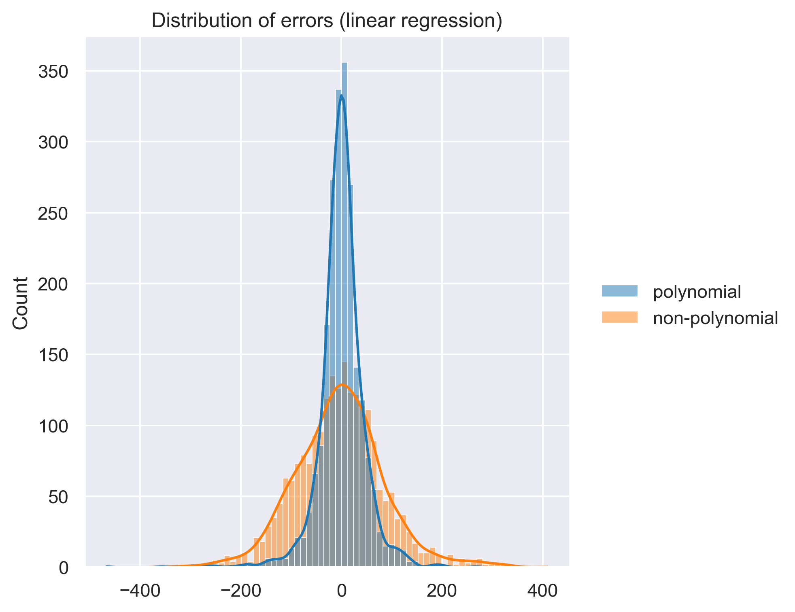

# Kaggel bike sharing demand-predictions

### 1. Exploratory Data Analysis (EDA)

Data is vizualized in different ways to draw conclusions for feature engineering and optimal demand prediction.

### 2. Prediction of demand

Features are engineered in several ways including polynomial features. Different Machine learning algorithms are applied on the data in order to predict the demand. The best performing model is linear regression with selected polynomialized features.
&nbsp;

Open in Google Colab:\
[bike_sharing_eda.ipynb](https://colab.research.google.com/github/to-schi/kaggle-bike-sharing-demand/blob/main/bike_sharing_eda.ipynb)\
[bike_sharing_predictions.ipynb](https://colab.research.google.com/github/to-schi/kaggle-bike-sharing-demand/blob/main/bike_sharing_predictions.ipynb)

&nbsp;

This project was created during the [Spiced Academy](https://www.spiced-academy.com) Data Science Bootcamp Nov/2021.